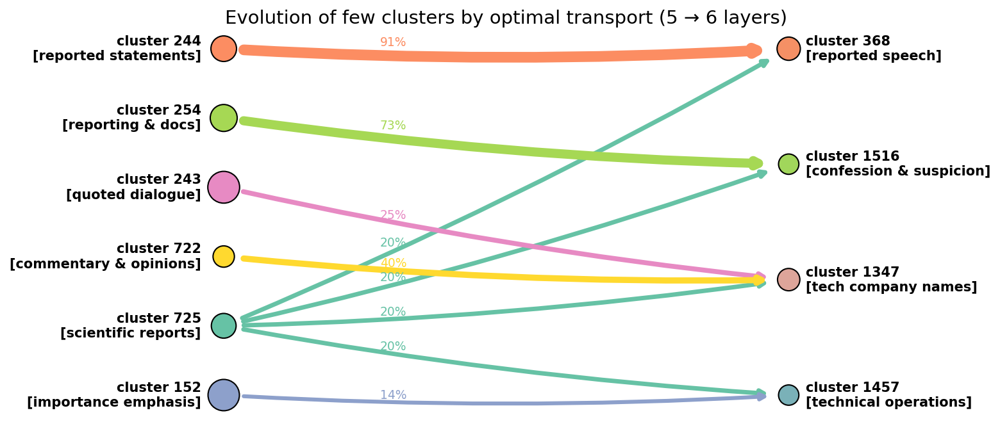
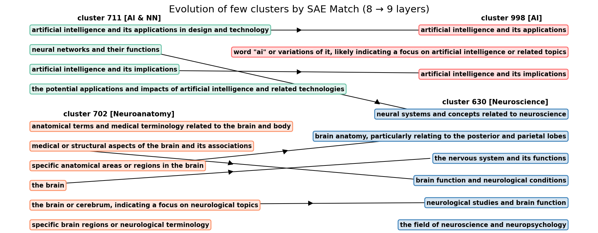

# Cluster Evolution of SAE Features Across Layers

This research-oriented pet-project investigates sparse autoencoders (SAE v5‑32k) trained on all 12 layers of pre-trained gpt-2 small. Feature clustering is performed using UMAP + HDBSCAN on both the columns of SAE decoder matrices and on embedding representations of SAE feature descriptions sourced from Neuronpedia. SAE Match is implemented for both decoder columns and text embedding, allowing for layer-by-layer cluster evolution analysis. Additionally, an alternative cluster evolution approach based on optimal transport is developed and evaluated.

---

[](LICENSE)


## Table of Contents

- [Introduction](#introduction)  
- [Installation](#installation)  
- [Usage](#usage)  
- [Repository structure](#repository-structure)  
- [Example Flows](#example-flows)  
- [Motivation: From Individual Features to Clusters](#motivation-from-individual-features-to-clusters)  
- [Project Summary: Five Key Insights](#project-summary-five-key-insights)  
- [Future Research Directions](#future-research-directions)  
- [Hardware & Software Prerequisites](#hardware--software-prerequisites)  
- [Contact](#contact)  


## Introduction

- A major challenge for interpretability in LLMs is that their hidden states (such as activations from the residual stream, MLP or attention blocks) are highly **polysemantic** — each neuron tends to "fire on" many unrelated concepts, making interpretation difficult.
- Sparse Autoencoders (SAE) are single-layer networks, with a separate SAE trained for each LLM layer, designed to reconstruct the hidden states under a sparsity constraint, using an overcomplete latent layer to isolate distinct, human-interpretable **monosemantic** features.
- In the article [[N. Balagansky, I. Maksimov, D. Gavrilov, Mechanistic Permutability: Match Features Across Layers, ICLR 2025](https://arxiv.org/abs/2410.07656)], the authors proposed **SAE Match** — a framework for aligning and tracing individual SAE features across successive layers of an LLM, focusing exclusively on *data-free* decoder columns/encoder rows.
- [Neuronpedia](https://www.neuronpedia.org) advances this line of work by generating natural-language descriptions for SAE features: it identifies the most strongly activating tokens for each feature and uses an external LLM to generate clear, human-interpretable summaries of these patterns.
- **My contribution**: I generalize SAE Match from the evolution of individual features to the evolution of their **clusters** in GPT-2-small with [SAE v5-32k](https://github.com/openai/sparse_autoencoder) by OpenAI. Clusters are obtained from UMAP + HDBSCAN clustering in both **(1)** the decoder column space and **(2)** the embedding space of feature text descriptions. We examine cluster evolution as induced by SAE Match of individual features and further employ optimal transport to analyze the evolution of clusters as unified entities. Our study tracks merge, split, survival, entropy, mutual information, and co-activation metrics (Jaccard, NPMI), offering a comprehensive view of concept dynamics.

This pet-project is deeply inspired by the article [[N. Balagansky, I. Maksimov, D. Gavrilov, Mechanistic Permutability: Match Features Across Layers, ICLR 2025](https://arxiv.org/abs/2410.07656)].

---


## Installation

1. Clone the repo:
```bash
git clone https://github.com/your-user/clustering-sae-project.git
cd clustering-sae-project
```
2. Activate environment:
```bash
conda env create -f environment.yml
conda activate clustering-sae
```
3. This [Google Drive link](https://drive.google.com/drive/folders/1x1pJsFo6U7HKsQejDwGFaN3GOYXJqhiE?usp=sharing) contains SAE weights (checkpoints/), final results (results/) and Neuronpedia descriptions (data/), which together take up about 5 GB.

## Usage

```bash
# 1) cluster Neuronpedia descriptions (UMAP + HDBSCAN)
python -m src.clustering --all

# 2) build sparse SAE-Match permutations in text-embedding space
python -m src.sae_match match --metric text

# 3) build inter-layer transition matrices for text metric
python -m src.evolution_of_clusters_sae build --metric text

# 4) plot split/survive/merge/leak evolution curves
python -m src.visualization.evolution_of_clusters_sae_plots
```

## Repository structure

- All auxiliary modules are in the folder src/ (clustering, coactivation study, SAE Match, cluster evolution via SAE Match and via optimal transport), in the folder /src/visualization there are all modules for visualization.

- There are two files in the notebooks folder: 
    - **composite-analysis.ipynb** sequentially calls the necessary modules, makes calculations and writes the results to the results folder, and also contains a discussion of the calculations and conclusions from the results
    - **theory.ipynb** contains the cell markdown with all the necessary theory and formulas

```
clustering-sae-project/
├── checkpoints/                # pre-trained SAE weights (layer0.pt … layer11.pt)
├── data/                       # Neuronpedia JSON dumps
│   └── gpt2-small-res_post_32k-oai/*.json
├── notebooks/                  # interactive analysis notebooks
│   ├── composite-analysis.ipynb
│   └── theory.ipynb
├── src/                        # all executable code
│   ├── clustering.py           # UMAP + HDBSCAN two-stage clustering
│   ├── cluster_transport.py    # OT-based cluster flow
│   ├── coactivations_study.py  # co-activation analysis
│   ├── evolution_of_clusters_sae.py
│   ├── metrics_for_cluster_evolution.py  # H / MI diagnostics
│   ├── sae_match.py            # k-NN + MinCostFlow matching
│   ├── sae_v5_32k.py
│   └── visualization/          # plotting helpers
│       ├── additional_pictures.py
│       ├── cluster_plots.py
│       ├── evolution_of_clusters_sae_plots.py
│       ├── explained_variance_plots.py
│       └── jaccard_npmi_plots.py
├── results/                    # auto-generated outputs
│   ├── clusters_all_layers/
│   ├── coactivations/
│   ├── labels/
│   ├── ot_plans/
│   ├── permutations/
│   ├── plots/
│   ├── transitions_2step/
│   ├── transitions_2step_mse/
│   ├── transitions_2step_ot/
│   ├── transitions_2step_text/
│   └── tokens_seq.npy
├── images_for_readme/
│   ├── flow_l5_l6.png
│   ├── flow_l8_l9.png
├── environment.yml
├── .gitignore
├── LICENSE
└── README.md                   
```

## Example Flows

**Optimal transport clusters evolution:**  


**SAE Match clusters evolution:**  


---

## Motivation: From Individual Features to Clusters


* **Representing Complex Concepts**. Individual features capture fine-grained details, but many concepts are inherently compositional and cannot be represented by just one feature. Clusters bring together related features to form richer semantic units, enabling the model to represent complex, high-level ideas more holistically.

* **Higher-level Model Control**. Manipulating thousands of individual features is impractical, but clusters provide a more manageable and effective way to control the model. Modifying or suppressing entire conceptual groups, rather than single features, offers a more robust and scalable approach to shaping model behavior and improving safety.

* **Evolution of concepts: semantic and functional reshuffling**. Cluster evolution analysis enables direct comparison of layers, showing how the LLM organizes, splits, and merges concepts, and which groups persist through the network. By labeling clusters (e.g., semantic, syntactic, positional), we can study how different functional circuits interact across layers, revealing how the model distributes and integrates syntax, semantics, and other information.

* **Softening rigid 1-to-1 SAE Match**. Optimal Transport offers a more powerful framework for studying concept evolution than one-to-one SAE Match, as it captures many-to-many transitions and provides a more complete picture of how conceptual groups transform across layers.

* **Are embeddings of text descriptions better?** We explore a novel direction by applying SAE-Match and cluster evolution analysis to the embeddings of text-based feature descriptions (Neuronpedia), rather than decoder columns/encoder raws.


---

## Project Summary: Five Key Insights


1. **Three-Phase Concept Evolution: Fragmentation → Consolidation → Specialization**  
   Both SAE-Match and Optimal Transport evolution of clusters confirm non-monotonic dynamics in 12-layer GPT2-small:
   - **fragmentation (layers 0–3):** a low cluster survival rate, high split/merge rates, a large number of clusters, and a low average cluster size — concepts are continually broken apart and redistributed.
   - **consolidation (layers 4–6):** maximal cluster survival rate, the number of clusters falls and the average cluster size peaks, a reduction in split and merge activity — condensation of many fine‐grained concepts into just a few broader, more general clusters.
   - **specialization (layers 7–11):** the survival rate is minimal, split > merge, a decrease in average cluster size, the number of clusters is increasing again, and a decrease of the Jaccard/NPMI metrics — contextual specialization of concepts.

2. **Text Description Embeddings > Decoder Columns**  
    The clustering of SAE features and the evolution of individual features/clusters were considered both in the space of decoder columns (`cos`/`mse` metrics) and in the space of text description embeddings (`text`). The unambiguous conclusion: text description embeddings *are better* in everything. In the semantic space (`text` metric), concepts exhibit robust survival rates coupled with pronounced split and merge activity, yielding a richer, more expressive trajectory of cluster evolution.

3. **Optimal Transport > SAE Match, at the cluster level**  
Optimal Transport yields a *more realistic* evolution of clusters. SAE-Match’s rigid one-to-one feature alignment prevents any feature from linking to multiple descendants, cluster-level matching softens this but still lacks Optimal Transport’s accuracy. By modeling soft many-to-many flows, Optimal Transport dramatically increases survival rates and demonstrates evolution as a smooth transformation rather than sudden births and deaths.

4. **From Overlapping to Specialized: How Encoding Changes with Depth**  
   Co-activation metrics (Relative Jaccard/NPMI) show that in early layers, many features within a cluster tend to activate together on the same tokens, while in later layers, these features respond to different tokens and capture different aspects of meaning — so the network shifts from duplicating information across features to dividing it among more specialized ones.

5. **Conceptual Mapping of LLMs Is Feasible and Valuable**  
  Our pipeline lets us track each semantic concept’s journey through the network, and by using both semantic clustering and advanced cluster-matching methods, we can precisely modify those concepts to improve the model’s safety, controllability, and efficiency.

---

## Future Research Directions


1. **Functional Typology of Clusters**  
   *Idea*: Use an external LLM to tag each cluster as “semantic,” “punctuation,” “positional,” “numeric,” etc., and then track how these categories evolve and interact with each other across layers through cluster evolution.\
   *Why*: A functional classification will expose how distinct information types — syntax, semantics, numbers etc. — interact and morph across layers, enriching our view of representational dynamics.  
   *Prototype*: For each layer’s clusters, feed the top keywords/descriptions to the LLM for a category label; then track and visualize category transitions through the consolidation and re-specialization phases.

2. **Generalize the evolution of clusters to other LLMs**  
   *Idea*: Apply the full pipeline (clustering, Optimal Transport and SAE cluster evolution) to a “zoo” of models (Llama 3, Mistral, Pythia, ViT, etc.) to test whether the Split → Merge → Split pattern and other results are universal.  
   *Why*: Could reveal architecture-agnostic “laws” of information organisation and guide future model design.  
   *Prototype*: Normalise metrics by relative depth, assess effects of MoE layers, size scaling, and modality.

3. **Conceptual Surgery — Targeted Behaviour Editing**  
   *Idea*: Use the Optimal transport based semantic map to reduce or neutralize undesirable behaviours (e.g., bias, toxicity) by identifying and modifying the responsible clusters at the relevant layers.  
   *Why*: Moves interpretability from passive diagnosis to active control with minimal side-effects.  
   *Prototype*: Locate the offending late-layer cluster → trace it back to layers 4-6 → zero or invert its activations during generation → verify that bias vanishes while perplexity remains stable.

4. **Dynamics of Fine-Tuning**  
   *Idea*: Track how conceptual clusters grow, shrink, or emerge during fine-tuning on a specialised task.  
   *Why*: Sheds light on how the model shifts its internal resources, loses old knowledge, and develops new skills.  
   *Prototype*: Capture cluster evolution trajectories with Optimal Transport for the baseline and multiple checkpoints (e.g., 10%, 50%, 100%), and measure changes in cluster sizes, the emergence and disappearance of clusters, and overall split/merge dynamics.


## Hardware & Software Prerequisites

This pet-project was developed on a Lenovo Legion laptop with:

- **GPU:** NVIDIA GeForce RTX 2060 (6 GB VRAM)  
- **CPU:** AMD Ryzen 5 4600H  
- **RAM:** 16 GB  
- **OS:** Windows 10  

All code has been tuned for this baseline setup; any machine meeting or exceeding these specs should certainly reproduce the results.


---

## Contact

rusalev.timofey@gmail.com, Timofei Rusalev, Moscow, Russia